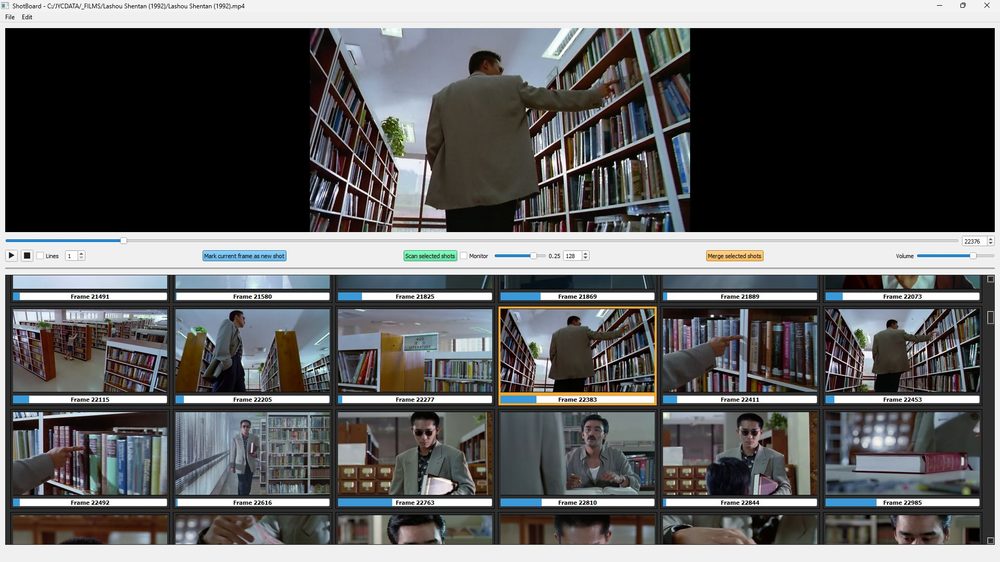

# ShotBoard v0.4.1
For **Windows** 10+ and **Linux** (not sure about **Mac**, feel free to try).

### ShotBoard: Visualize movies shot by shot

**ShotBoard** is a Python application designed for **filmmakers**, **editors**, **storyboarders** and **enthusiasts** alike, who want to explore the structural breakdown of a movie.

With **ShotBoard**, you can:
- Open a movie file (MP4) and detect its individual shots automatically.
- Display those shots as thumbnails in a grid-style storyboard for quick navigation.
- Hover over thumbnails to preview the corresponding shots instantly.

**ShotBoard** offers a seamless way to explore film storytelling.

## Installation

### Install ffmpeg
ffmpeg is required for video processing. Here's how to install it on Windows 10+:

*Windows users will find more visual installation instructions [on this page](https://phoenixnap.com/kb/ffmpeg-windows).*

1. **Download ffmpeg**:
- Go to the [ffmpeg official website](https://ffmpeg.org/download.html).
- Under "**Get packages & executable files**", select a pre-built version for Windows.
- Download the ZIP file for your system (e.g. ffmpeg-release-essentials.zip).

2. **Extract the ffmpeg files**:
- Extract the ZIP file contents to a folder of your choice (e.g. C:\ffmpeg).

3. **Add ffmpeg to the PATH environment variable**:
- Open the <kbd>Start</kbd> menu, search for "**Environment Variables**", and select "**Edit the system environment variables**".
- In the "**System Properties**" window, click <kbd>Environment Variables</kbd>.
- Under **System variables**, find the **PATH** variable and click <kbd>Edit</kbd>.
- Click <kbd>New</kbd>, then enter the `bin` folder path where ffmpeg is located (e.g. C:\ffmpeg\bin).
- Click <kbd>OK</kbd> to save your changes.

4. **Test the installation**:
- Open Command Prompt and type `ffmpeg --version`.
- If ffmpeg is installed correctly, you’ll see version information displayed.

### Install Python 3.10.6
Ensure **Python 3.10.6** is installed on your system (although it might work on newer versions as well).

1. **Download Python**:
- Go to the [official Python website](https://www.python.org/downloads/).
- Download the installer for your system (e.g. Windows x86-64 executable installer for Windows 10+).

2. **Install Python**:
- Run the installer and check the box for **Add Python to PATH**.
- Complete the installation.

3. **Verify Python installation**:
- Still in Command Prompt, type `python --version`.
- If Python is installed correctly, it will display the version number.

### Install the Necessary Dependencies
- Still in Command Prompt, type the following command:
`pip install PyQt5 opencv-python ffmpeg-python numpy scikit-image pyaudio matplotlib`

- If you encounter permission issues, try:
`pip install --user PyQt5 opencv-python ffmpeg-python numpy scikit-image pyaudio matplotlib`

You're now ready to run **ShotBoard**! 🎉

## User Guide: How to Use ShotBoard
### Opening a Video File
1. Click on **File > Open Video**.
2. Select the desired video file.
The first frame of the video will be displayed at the top half of the interface (the 'video'). As no shots have been detected yet, a single shot will be listed at the bottom half of the interface (the 'board'), representing the entire video.

### Navigating Through the Video
Use the slider/spinbox or the arrow keys on your keyboard to navigate the video frame-by-frame or jump by larger intervals:
- **Left/Right Arrow**: Move backward or forward by 1 frame.
- **Shift + Left/Right Arrow**: Move backward or forward by 4 frames.
- **Ctrl + Left/Right Arrow**: Move backward or forward by 1 second.
- **Alt + Left/Right Arrow**: Move backward or forward by 4 seconds.

### Scanning and Detecting Shots
To detect all shots in the video:
1. Select the only available shot in the board (if not already selected).
2. Click <kbd>Scan selected shots</kbd>.
3. ShotBoard will analyze the video and display the detected shots as thumbnails.

Tip: To display a detection graph in realtime, unable the <kbd>Monitor</kbd> checkbox BEFORE starting the detection process. You will be able to monitor when and why shots are detected (or not) by observing shot similiarities returned by the SSIM algorhythm. The lower the value, the less similar the current frame is to the previous one. Just remember to close the popup window when you're done.

### Saving and Opening Shot Lists
- To save detected shots for later, click on **File > Save** or **File > Save As**.
- To load a previously saved shot list, click on **File > Open Shot List**.

### Visualizing Shots
- To preview a shot, hover the mouse cursor over a shot thumbnail. The thumbnail will animate and play the shot as long as you hover it.
- To display a thumbnail as 'line drawings', check the <kbd>Lines</kbd> box and hover the thumbnail again. The greater the number, the darker the lines.
- Disable <kbd>Lines</kbd> to display thumbnails as video frames again.

Tip: check <kbd>Lines</kbd> BEFORE loading a saved shot list to display all thumbnails as 'lines'.

### Setting the Video to the Beginning of a Specific Shot
- Click on a shot thumbnail to set the video to the start of that shot.

### Correcting Shot Detection Errors
1. Select the incriminated shot (**Shift + Click** to add more shots to the selection).
2. Decrease the similarity threshold from 0.25 to around 0.10 and click on <kbd>Scan selected shots</kbd> again. New detected shots will automatically be added to the list.
- If a shot still incorrectly contains multiple shots:
1. Use the slider/spinbox or arrow keys to locate the frame where the first undetected shot begins.
2. Click **Mark current frame as new shot**. A new shot will be added to the list.
3. Repeat until all shots are correctly separated.

#### Merging Shots
1. Select multiple shots using **Shift + Click**.
2. Click **Merge selected shots**.

## Tips
Although ShotBoard will successfully detect most of the shots, it may struggle when:
- Transitions are blurry (e.g. fading to white or black, crossfading, strong motion blur)
- The lighting is stroboscopic (e.g. lightning, flashing lights)
- Images are choppy (e.g. faked slow motion in post)
To avoid overdetecting shots:
1. Start by scanning at a similarity threshold around 0.25.
2. Merge overdetected shots.
3. Decrease the similarity threshold to around 0.10, then re-scan the underdetected shots as you see fit.

## Conclusion  
ShotBoard provides an intuitive way to analyze movies, study cinematic storytelling and explore editing techniques. Displaying shots as animated 'line drawings' can tremendously help studying storyboarding.

We hope you enjoy using ShotBoard and find it helpful in your creative or analytical endeavors. If you have any feedback, suggestions, or run into issues, please don’t hesitate to reach out or contribute.
